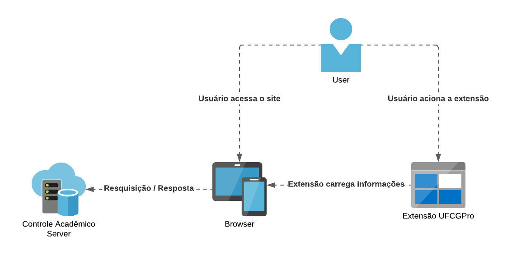
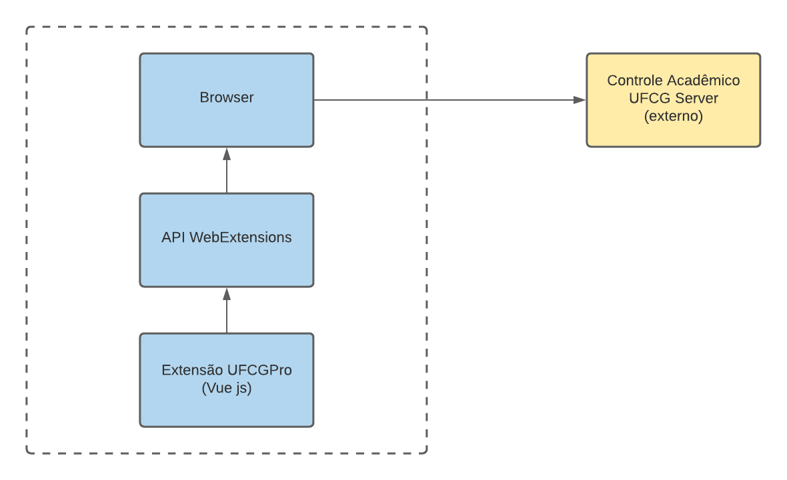
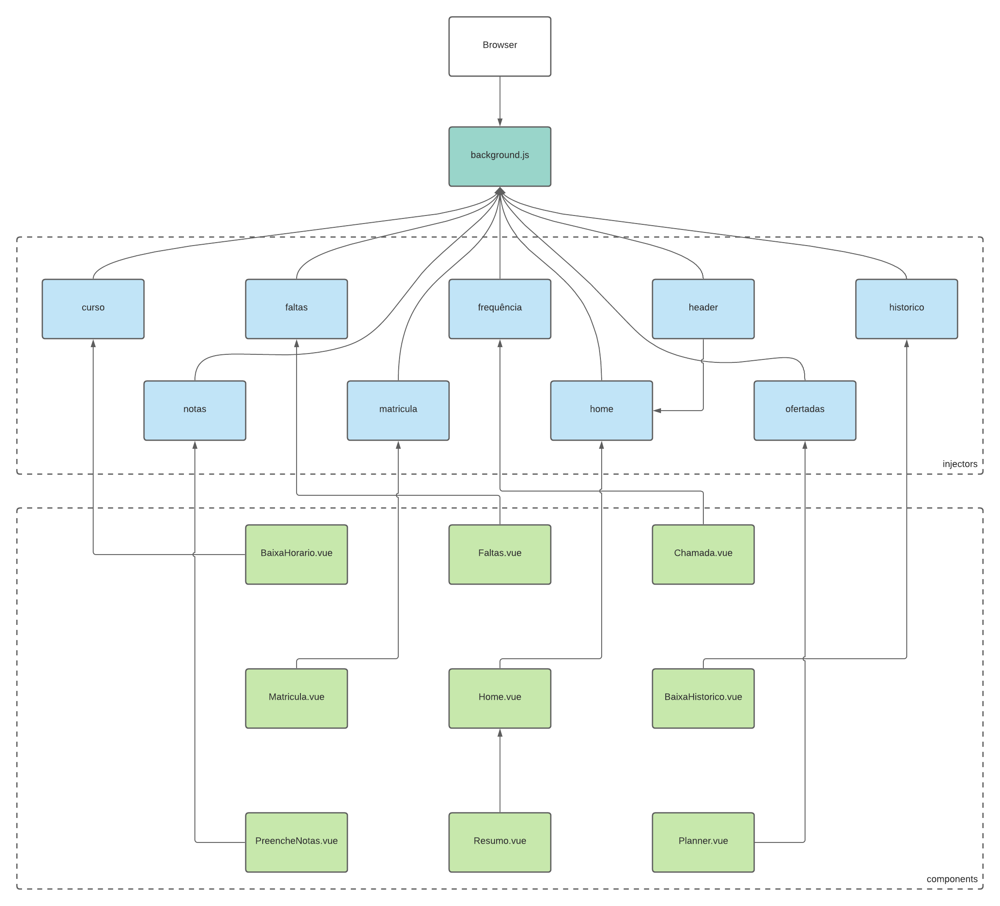
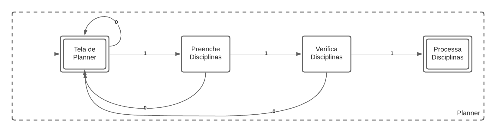

+++
title = "UFCGPro"
date = 2020-10-11
tags = []
categories = []
+++

# Autores

Este documento foi produzido por Matheus Silva Araújo.

- Matrícula: 117210375
- Contato: matheus.araujo@ccc.ufcg.edu.br
- Projeto documentado: https://github.com/lucis/ufcg-pro

# Descrição Arquitetural -- Extensão do Controle Acadêmico da Universidade Federal de Campina Grande.

Este documento descreve parte da arquitetura do projeto [UFCGPro](https://github.com/lucis/ufcg-pro). Essa descrição foi baseada principalmente no modelo [C4](https://c4model.com/).

## Descrição Geral sobre o Parlametria

O UFCGPro é uma ferramenta para melhorar o uso do Controle Acadêmico da Universidade Federal de Campina Grande. 

## Extensão do Controle Acadêmico

### Objetivo Geral

Implementar um serviço para auxiliar discentes e docentes em atividades comuns da rotina acadêmica institucional como disciplinas, matrículas e afins.

### Objetivos Específicos

Adicionar recursos ao controle acadêmico da Universidade Federal de Campina Grande a fim de tornar mais práticas as atividades listadas nesse documento.

### Contexto

O contexto do sistema se resume ao usuário, o browser e a extensão. O usuário adiciona a extensão ao browser, o usuário acessa o Controle Acadêmico pelo browser e a extensão complementa recursos do Controle Acadêmico.

### Containers

Os containers do sistema se resumem ao browser, pois a extensão UFCGPro funciona individualmente no browser de cada usuário, sem a necessidade de estar implantada num servidor externo.

### Componentes

Os componentes do sistema podem ser descritos por: *background.js*, que faz a comunicação entre o usuário e os *injectors*; os *injectors*, que atuam como controllers do sistema e acionam os *components*; que por sua vez, fazem as chamadas necessárias e a comunicação com o sistema do Controlador Acadêmico

### Código

<pre>
Nesta etapa não faremos diagramas que apresentam detalhes da
implementação. Faremos isso mais adiante.
</pre>

### Visão de Informação

Nesse exemplo, temos a visão da informação no momento de realizar o planejamento e automatização de uma matrícula. Primeiramente, o usuário acessa a tela de planner, preenche as disciplinas, o sistema verifica se é possível realizar a matrícula e por fim, realiza o processamento do pedido.

# Contribuições Concretas

*Descreva* aqui os PRs enviados para o projeto e o status dos mesmos. Forneça os links dos PRs.